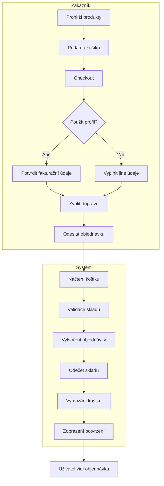
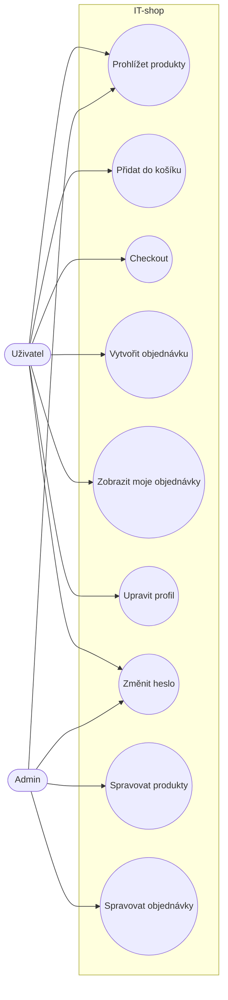
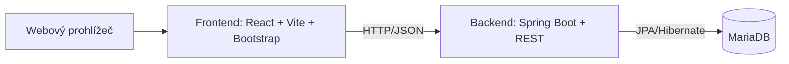
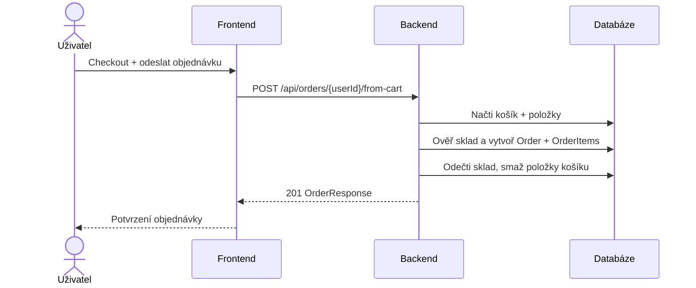
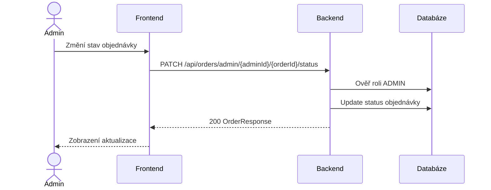

# IT-shop – dokumentace

## Přehled projektu

IT‑shop je webový e‑shop s rolemi USER/ADMIN. Uživatelé prohlížejí produkty, přidávají je do košíku, procházejí checkoutem s fakturačními údaji a dopravou a vytvářejí objednávky. Admin spravuje sklad (produkty) a mění stavy objednávek. Backend je postaven na Spring Boot + JPA + MariaDB, frontend na React (Vite) + Bootstrap.

---

## Backend – soubory a metody

### `backend/src/main/java/com/osu/michja56/backend/BackendApplication.java`
- `main(String[] args)`: spouští Spring Boot aplikaci.

### `backend/src/main/java/com/osu/michja56/backend/config/DataInitializer.java`
- `initDatabase(ProductRepository, UserRepository)`: při startu vytvoří základní produkty a uživatele (admin + user), pokud je databáze prázdná.

---

### Controllers

**`backend/src/main/java/com/osu/michja56/backend/controller/AuthController.java`**
- `login(LoginRequest)`: ověří přihlašovací údaje, vrací `UserResponse` nebo 401.
- `register(RegisterRequest)`: validuje registraci, kontroluje unikátní username/email, ukládá uživatele s rolí USER.
- `changePassword(ChangePasswordRequest)`: ověří aktuální heslo a nastaví nové (min. 6 znaků).
- `passwordMatches(User, String)`: ověřuje heslo, podporuje migraci plaintext → bcrypt.
- `isBcryptHash(String)`: detekuje bcrypt hash.
- `trimToNull(String)`: pomocná metoda pro trim/null (aktuálně nepoužitá).

**`backend/src/main/java/com/osu/michja56/backend/controller/UserController.java`**
- `updateProfile(Long, UpdateProfileRequest)`: aktualizuje fakturační údaje uživatele, validuje vstupy a unikátnost e‑mailu.

**`backend/src/main/java/com/osu/michja56/backend/controller/ProductController.java`**
- `getAllProducts()`: vrací seznam produktů.
- `createProduct(Product)`: vytvoří nový produkt.
- `updateProduct(Long, ProductUpdateRequest)`: upraví celý produkt (název, popis, cena, sklad, obrázek).
- `updateStock(Long, StockUpdateRequest)`: upraví pouze sklad.
- `deleteProduct(Long)`: smaže produkt.

**`backend/src/main/java/com/osu/michja56/backend/controller/CartController.java`**
- `getCart(Long)`: načte košík uživatele.
- `addItem(Long, AddToCartRequest)`: přidá položku do košíku.
- `updateItem(Long, Long, UpdateCartItemRequest)`: změní množství v košíku.
- `removeItem(Long, Long)`: odebere položku z košíku.

**`backend/src/main/java/com/osu/michja56/backend/controller/OrderController.java`**
- `createOrderFromCart(Long, OrderCreateRequest)`: vytvoří objednávku z košíku.
- `getOrders(Long)`: vrací objednávky uživatele.
- `getAllOrders(Long)`: vrací všechny objednávky (ADMIN).
- `updateOrderStatus(Long, Long, OrderStatusUpdateRequest)`: změna stavu objednávky (ADMIN).

---

### Services

**`backend/src/main/java/com/osu/michja56/backend/service/ProductService.java`**
- `getAllProducts()`: načte všechny produkty.
- `getProductById(Long)`: vyhledá produkt podle ID.
- `createProduct(Product)`: uloží nový produkt.
- `updateStock(Long, int)`: aktualizuje sklad produktu.
- `deleteProduct(Long)`: smaže produkt.
- `updateProduct(Long, Product)`: upraví celý produkt.

**`backend/src/main/java/com/osu/michja56/backend/service/CartService.java`**
- `getCart(Long)`: vrací košík uživatele (vytvoří, pokud neexistuje).
- `addItem(Long, Long, int)`: přidá nebo navýší položku; kontroluje sklad.
- `updateItemQuantity(Long, Long, int)`: upraví množství (0 → smazání).
- `removeItem(Long, Long)`: odebere položku.
- `getOrCreateCart(Long)`: interně zajistí košík uživatele.
- `ensureStockAvailable(Product, int)`: hlídá dostupnost skladu.
- `buildResponse(Cart)`: mapuje `Cart` → `CartResponse`.

**`backend/src/main/java/com/osu/michja56/backend/service/OrderService.java`**
- `createOrderFromCart(Long, OrderCreateRequest)`: z košíku vytvoří objednávku, odečte sklad, vymaže košík.
- `getOrdersForUser(Long)`: vrací objednávky uživatele.
- `getAllOrders(Long)`: vrací všechny objednávky (ADMIN).
- `updateOrderStatus(Long, Long, String)`: upraví stav objednávky (validace stavů).
- `ensureAdmin(Long)`: interní kontrola role ADMIN.
- `isAllowedStatus(String)`: povolené stavy (NEW/PAID/SHIPPED/CANCELED).
- `buildResponse(Order, List<OrderItem>)`: mapuje `Order` → `OrderResponse`.
- `resolveShippingMethod(OrderCreateRequest)`: validuje dopravu.
- `resolveBillingInfo(User, OrderCreateRequest)`: fakturační údaje z profilu nebo z formuláře.
- `BillingInfo`: record pro fakturační údaje.

---

### Modely (JPA entity)

**`backend/src/main/java/com/osu/michja56/backend/model/User.java`**
- Pole: username, password, jméno, adresa (street/city/postalCode), email, phone, role.
- `syncLegacyAddress()`: udržuje kompatibilní sloučenou adresu v `legacyAddress`.

**`backend/src/main/java/com/osu/michja56/backend/model/Product.java`**
- Pole: name, description, price (BigDecimal), stockQuantity, imageUrl.

**`backend/src/main/java/com/osu/michja56/backend/model/Cart.java`**
- Vztahy: `@OneToOne` User, `@OneToMany` CartItem.
- Pole: createdAt.

**`backend/src/main/java/com/osu/michja56/backend/model/CartItem.java`**
- Vztahy: `@ManyToOne` Cart, `@ManyToOne` Product.
- Pole: quantity, priceAtAdd.

**`backend/src/main/java/com/osu/michja56/backend/model/Order.java`**
- Vztahy: `@ManyToOne` User, `@OneToMany` OrderItem.
- Pole: total, status, billing údaje, shippingMethod, createdAt.
- `syncLegacyBillingAddress()`: udržuje starý sloučený billing adresní řádek.

**`backend/src/main/java/com/osu/michja56/backend/model/OrderItem.java`**
- Vztahy: `@ManyToOne` Order, `@ManyToOne` Product.
- Pole: quantity, priceAtOrder, lineTotal.

---

### Repositories

**`backend/src/main/java/com/osu/michja56/backend/repository/UserRepository.java`**
- `findByEmail(String)`
- `findByUsername(String)`

**`backend/src/main/java/com/osu/michja56/backend/repository/ProductRepository.java`**
- standardní CRUD z `JpaRepository`.

**`backend/src/main/java/com/osu/michja56/backend/repository/CartRepository.java`**
- `findByUserId(Long)`

**`backend/src/main/java/com/osu/michja56/backend/repository/CartItemRepository.java`**
- `findByCartId(Long)`
- `findByCartIdAndProductId(Long, Long)`
- `findByIdAndCartId(Long, Long)`

**`backend/src/main/java/com/osu/michja56/backend/repository/OrderRepository.java`**
- `findByUserIdOrderByCreatedAtDesc(Long)`
- `findAllByOrderByCreatedAtDesc()`

**`backend/src/main/java/com/osu/michja56/backend/repository/OrderItemRepository.java`**
- standardní CRUD.

---

### DTO (přehled)

**Auth/User**
- `LoginRequest`: username, password.
- `RegisterRequest`: username, password, email, firstName, lastName, street, city, postalCode, phone.
- `ChangePasswordRequest`: userId, currentPassword, newPassword.
- `UpdateProfileRequest`: firstName, lastName, street, city, postalCode, email, phone.
- `UserResponse`: id, username, email, firstName, lastName, street, city, postalCode, phone, role.
  - `from(User)`: mapování entity na DTO.

**Products/Stock**
- `ProductUpdateRequest`: name, description, price, stockQuantity, imageUrl.
- `StockUpdateRequest`: stockQuantity.

**Cart**
- `AddToCartRequest`: productId, quantity.
- `UpdateCartItemRequest`: quantity.
- `CartItemResponse`: id, productId, productName, price, quantity, lineTotal.
- `CartResponse`: id, userId, items, total.

**Orders**
- `OrderCreateRequest`: useProfile, firstName, lastName, street, city, postalCode, email, phone, shippingMethod.
- `OrderItemResponse`: id, productId, productName, quantity, priceAtOrder, lineTotal.
- `OrderResponse`: id, userId, items, total, status, createdAt, billing údaje, shippingMethod.
- `OrderStatusUpdateRequest`: status.

---

## Frontend – soubory (1 věta)

- `frontend/src/main.jsx` — vstupní bod React aplikace a mount do DOM.
- `frontend/src/App.jsx` — hlavní layout, navigace, routování přes `activePage`, správa stavu uživatele.
- `frontend/src/components/Login.jsx` — přihlášení/registrace uživatele.
- `frontend/src/components/ProductList.jsx` — výpis produktů a přidání do košíku.
- `frontend/src/components/Cart.jsx` — košík, změna množství a přechod na checkout.
- `frontend/src/components/Checkout.jsx` — výběr fakturačních údajů a dopravy, odeslání objednávky.
- `frontend/src/components/UserOrders.jsx` — přehled objednávek uživatele.
- `frontend/src/components/AdminProducts.jsx` — skladová tabulka a přechod na přidání/úpravu.
- `frontend/src/components/AddProductForm.jsx` — formulář pro přidání/úpravu produktu.
- `frontend/src/components/AdminOrders.jsx` — přehled objednávek a změna stavu.
- `frontend/src/components/BillingProfile.jsx` — editace fakturačních údajů profilu.
- `frontend/src/components/ChangePassword.jsx` — změna hesla.

---

## SWOT analýza

**Strengths (S)**
- Jasné oddělení rolí USER/ADMIN.
- Přehledná doména: produkty, košík, objednávky.
- Validace vstupů a základní bezpečnost hesel (BCrypt).

**Weaknesses (W)**
- Manuální front‑routing bez React Routeru.
- Chybí autentizační tokeny/sessions (pouze jednoduchý login).
- Lint varování a `useEffect` patterny pro setState.

**Opportunities (O)**
- Zavedení JWT + protected routes.
- Platební brány a reálná doprava (výdejní místa).
- Rozšíření o kategorie, filtrování a vyhledávání.

**Threats (T)**
- Bez reálné auth vrstvy je riziko neoprávněných požadavků.
- Při růstu dat nutnost optimalizací DB a paginace.
- Přechod na produkci vyžaduje hardening a audit.

---

## BPMN (Mermaid)



---

## UML Use Case (Mermaid)



---

## Diagram architektury (technologie a vazby)



---

## Sekvenční diagramy

### Vytvoření objednávky (USER)



### Změna stavu objednávky (ADMIN)



---

## Deployment diagram (Mermaid)

```mermaid
flowchart TD
  subgraph Klient
    B[Prohlížeč]
    F[React SPA (Vite)]
    B --> F
  end

  subgraph Server
    S[Spring Boot aplikace]
    D[(MariaDB)]
    S --> D
  end

  F -->|HTTP/JSON| S
```

